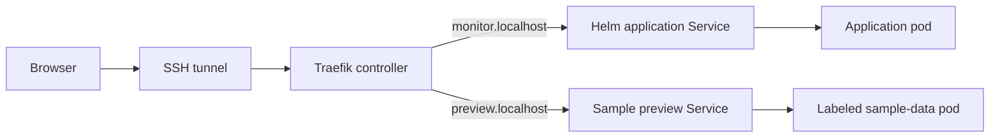

# Local Ingress exercise

An Ingress connects a hostname and path to a Kubernetes Service. A controller
reads that rule and handles incoming HTTP requests. This lab uses the official
Traefik Helm chart, version 41.5.0, with Traefik 3.7.13 pinned by image digest.
It watches only `devops-helm-local` and `devops-preview` and handles the
`lab-traefik` class. The controller uses a ClusterIP Service; access is through
a loopback port forward and SSH. No public DNS, load balancer, or AWS account
is involved. HTTPS is not part of this local HTTP exercise.

## Request path



## Install and check

Run the basic [local Kubernetes exercise](README.md) first. The `monitor` Helm
release and the sample preview Service must already exist. Then, from the
repository root on the development VM:

```bash
bash ci/local-kubernetes/install-ingress.sh
bash ci/local-kubernetes/verify-ingress.sh
```

The installer validates the chart download's SHA256 checksum, installs the
controller, enables the application's existing Ingress template, and applies
a separate Ingress for the sample preview. Both scripts refuse another cluster
context or API address. The official chart supplies the controller's standard
read/watch permissions; use this setup only on the dedicated local lab.
The dashboard, custom-resource provider, and Gateway API provider are disabled.

The check script opens and closes its own temporary port forward. It verifies:

| Request | Expected result |
| --- | --- |
| `monitor.localhost/healthz` | 200 and the application health response |
| `monitor.localhost/` | 503 and the missing-AWS-access message |
| `preview.localhost/` | 200 and the visible sample-data notice |
| `preview.localhost/static/style.css` | 200 and the expected stylesheet |
| `unconfigured.localhost/` | 404 from the controller |

A 503 from the real inventory is expected here because the test credentials
are empty. It is different from a routing failure: the health request and
application-specific error message prove that the request reached Flask.

## Open the two hosts in a browser

After the check finishes, run this on the VM and keep it open:

```bash
export KUBECONFIG="$HOME/.config/devops-kubernetes/kubeconfig"
.tools/bin/kubectl -n devops-ingress port-forward service/lab-traefik 15004:80 --address 127.0.0.1
```

On the workstation, keep this SSH connection open:

```bash
ssh -N -L 15004:127.0.0.1:15004 devops-lab
```

Open `http://preview.localhost:15004` for the labeled demo, or
`http://monitor.localhost:15004` for the application without AWS access.
The workstation browser used for this exercise resolves both localhost names;
no hosts-file change was needed.

Before rerunning `verify-ingress.sh`, stop the VM's manual port forward so the
script can use port 15004. The lower-level Kubernetes exercise disables the
application Ingress when it installs its baseline values; rerun the Ingress
installer afterward if needed.

## Troubleshooting

- Connection refused: check the VM port forward and workstation SSH tunnel.
- Controller 404: check the hostname, Ingress rule, and `lab-traefik` class.
- Application inventory 503 with a healthy `/healthz`: check AWS access when
  the approved account becomes available.

Local success does not verify the course cluster's controller, DNS, HTTPS,
or AWS permissions. Configure those separately when remote access is provided.

Official references: [Kubernetes Ingress](https://kubernetes.io/docs/concepts/services-networking/ingress/)
and [Traefik installation](https://doc.traefik.io/traefik/setup/kubernetes/).
