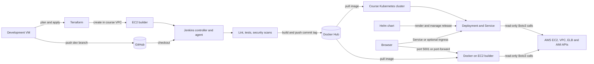

# Project architecture

The project follows one path from source code to a running application. GitHub
stores the source and branch history, Jenkins checks each change and publishes
an immutable image, and the deployment targets run that image. Terraform
creates the AWS builder; Kubernetes and Helm manage the application workload.

## Responsibilities

| Component | Responsibility |
| --- | --- |
| GitHub | Stores source, review history, feature branches, and the final pull request. |
| Terraform | Creates the `builder` instance and its restricted security group in the existing course VPC. |
| Jenkins | Runs quality and security gates, builds the image, and publishes a commit-specific tag. |
| Docker Hub | Stores the image that is used by both the EC2 and Kubernetes deployments. |
| Flask application | Reads AWS inventory through Boto3 and presents EC2, VPC, load balancer, and AMI data. |
| Kubernetes | Keeps the requested number of application pods running and exposes them through a stable Service. |
| Helm | Packages the Kubernetes resources and records install, upgrade, and rollback revisions. |

## Trust boundaries

AWS and registry credentials are supplied only at runtime. They are never
stored in the image or committed to Git. Terraform state, real variable files,
private keys, Kubernetes credential files, and raw logs remain outside the
public repository. The application identity needs read-only AWS permissions.

Jenkins can control Docker on its dedicated agent, so it runs only trusted
repository code. The Jenkins interface and local Kubernetes API stay behind
loopback or an SSH tunnel rather than being exposed directly to the internet.

## Verification boundary

The complete path has been exercised locally through Jenkins, Docker Hub, kind,
and Helm. The AWS builder and course Kubernetes cluster remain deployment
targets until the course provides access. Local evidence proves that the code
and automation work together; it does not claim that the remote environments
have already been deployed.
