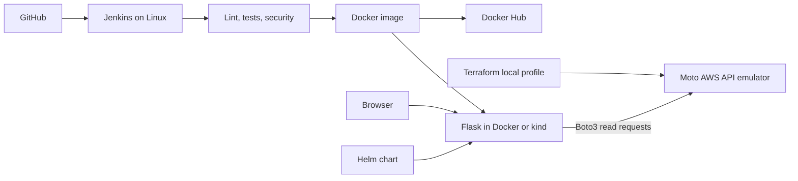

# Project architecture

GitHub stores source and history. Jenkins checks the source, builds and scans
the application image, and publishes a commit tag. Compose or kind runs the
application. Helm manages a separate release in kind.

Terraform creates VPC, subnet, routing, security-group, EC2, AMI, and
load-balancer records in Moto. The dashboard reads those records on every
request. Creating or deleting an API resource changes the next page response.

The emulator's EC2 entry is a record, not a booted VM. The actual application
and Jenkins run on the Linux development host. A separate Terraform
configuration supports real AWS deployment into a supplied existing VPC,
but that cloud path has not been run.

## Credentials and access

The local profile uses fixed dummy credentials and local service endpoints.
Compose keeps the application and emulator on an internal network; the
Terraform container also needs internet access for provider downloads.
The kind Services are internal; browser access uses loopback port forwarding.

Real AWS keys, Docker Hub tokens, Terraform state, and kubeconfig files are
excluded from public Git history. The Jenkins Docker-capable agent is used
only for trusted project code.
